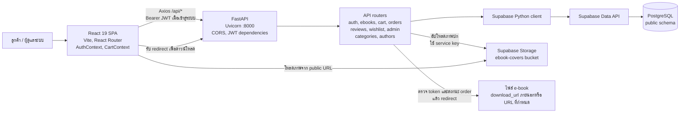

# E-Book Mart

## ภาพรวมสถาปัตยกรรม

เว็บร้าน e-book แบ่งเป็น frontend แบบ SPA, backend API และ Supabase สำหรับข้อมูลกับไฟล์ โดย frontend ติดต่อฐานข้อมูลผ่าน backend เท่านั้น

### องค์ประกอบ

| องค์ประกอบ | ใช้ทำอะไร | อยู่ตรงไหน |
|---|---|---|
| React | สร้างหน้าร้านและหน้าผู้ดูแล | `Web/frontend/src/pages/`, `components/` |
| Vite | รันเว็บระหว่างพัฒนาและ build frontend | `Web/frontend/package.json`, `vite.config.js` |
| React Router | เปลี่ยนหน้าและกำหนด URL ของแต่ละหน้า | `Web/frontend/src/App.jsx` |
| AuthContext / CartContext | เก็บและจัดการสถานะผู้ใช้กับตะกร้าที่ใช้ร่วมกันหลายหน้า | `Web/frontend/src/context/` |
| Axios | เรียก backend และแนบ JWT ใน request | `Web/frontend/src/services/api.js` |
| FastAPI | ประกาศ API และรวม router ของระบบ | `Web/backend/main.py`, `routers/` |
| Uvicorn | รัน FastAPI เป็น web server ที่พอร์ต 8000 | `Web/backend/main.py` |
| CORS | อนุญาตให้ frontend เรียก API จาก origin ที่กำหนด | `Web/backend/main.py`, `Web/backend/config.py` |
| Pydantic | ตรวจสอบ/กำหนดรูปแบบข้อมูล request และการตั้งค่า | `Web/backend/models/`, `Web/backend/config.py` |
| JWT + bcrypt | JWT ใช้ยืนยันคำขอ; bcrypt ใช้ hash และตรวจรหัสผ่าน | `Web/backend/utils/auth.py`, `routers/auth.py` |
| Supabase Python client | ส่งคำสั่งอ่าน/เขียนข้อมูลจาก backend ผ่าน Supabase Data API | `Web/backend/database.py`, `routers/` |
| PostgreSQL | เก็บข้อมูลสัมพันธ์ใน schema `public` เช่น users, ebooks, orders | `Supabase/ebookmart_live_schema.sql` |
| Supabase Storage | เก็บไฟล์ภาพปกที่ผู้ดูแลอัปโหลด | `Web/backend/routers/admin.py`, bucket `ebook-covers` |
| Download URL + token | ตรวจสิทธิ์/วันหมดอายุก่อน redirect ผู้ซื้อไปยังไฟล์ e-book | `Web/backend/routers/orders.py`, ตาราง `download_links` |

Frontend อ่าน API URL จาก `VITE_API_URL` (ค่าเริ่มต้น `http://localhost:8000`) และเก็บ JWT ใน `localStorage`; backend โหลดค่าการเชื่อมต่อและ signing key จาก environment variables

### กลุ่มข้อมูลหลัก

- **บัญชีและสิทธิ์**: `roles`, `users`
- **แคตตาล็อก**: `ebooks`, `authors`, `categories`
- **การเลือกซื้อ**: `carts`, `cart_items`, `wishlists`, `reviews`
- **คำสั่งซื้อและดาวน์โหลด**: `orders`, `order_items`, `payments`, `download_links`

รายละเอียดคอลัมน์และความสัมพันธ์อยู่ใน [Supabase/data-dictionary.md](Supabase/data-dictionary.md) และ [Mermaid/E-book-mart.mmd](Mermaid/E-book-mart.mmd)

### เส้นทางการทำงานสำคัญ

1. **เข้าสู่ระบบ**: browser ส่งอีเมล/รหัสผ่านไป `/api/auth/login`; backend ตรวจข้อมูลผู้ใช้และสร้าง JWT; frontend เก็บ token และส่งเป็น Bearer token ในคำขอที่ต้องยืนยันตัวตน
2. **สั่งซื้อ**: browser เรียก cart/order API; backend อ่านและเขียน `carts`, `cart_items`, `orders` และ `order_items` ผ่าน Supabase; admin จัดการสถานะคำสั่งซื้อผ่าน admin API
3. **ดาวน์โหลด**: เมื่อ admin ยืนยันคำสั่งซื้อ backend สร้าง download token ที่มีวันหมดอายุ; endpoint ดาวน์โหลดตรวจ token และสถานะ order ก่อน redirect ไป URL ของไฟล์
4. **จัดการแคตตาล็อก**: admin API จัดการหนังสือ/หมวดหมู่/ผู้แต่ง และอัปโหลดภาพปกไป Storage; หน้า storefront อ่านข้อมูลหนังสือและแสดงรูปปกจาก URL ที่ได้

### ขอบเขตและข้อสังเกต

- มี `Supabase/config.toml` สำหรับการตั้งค่า Supabase local แต่เอกสารใน repository ยังไม่ได้ระบุขั้นตอน deploy หรือ hosting ของแต่ละส่วน
- มีข้อมูล payment/slip และ endpoint สำหรับผู้ดูแลจัดการสถานะ แต่ไม่พบการเชื่อมต่อ payment gateway ภายนอกจากเส้นทางโค้ดที่ตรวจ
- E-slip ถูกเก็บใน Supabase Storage bucket แบบ private ชื่อ `payment-slips`; backend ต้องกำหนด `SUPABASE_SERVICE_KEY` เพื่ออัปโหลดและสร้างลิงก์พรีวิวชั่วคราว โดยระบบจะสร้าง bucket ให้อัตโนมัติเมื่ออัปโหลดครั้งแรก
- การตั้งค่าการเชื่อมต่อและ signing key มาจาก environment variables ใน backend; ไม่ควรใส่ค่าจริงของ secrets ไว้ในเอกสารหรือ source control

## ส่วนที่ 5: บันทึกผลการทดสอบระบบ 8 กรณี

กรณีทดสอบอ้างอิงจากหน้าร้านและ API ที่มีใน repository เนื่องจากไม่พบเอกสาร `docs/user_stories_and_acceptance_criteria.md` ตามตัวอย่าง ตารางนี้แยกผลที่รันทดสอบจริงออกจากกรณีที่ยังต้องทดสอบกับ frontend, backend และ Supabase ที่กำลังทำงาน

| ลำดับ | กรณีทดสอบ (Test Scenario) | ข้อมูลนำเข้า (Test Input) | ผลลัพธ์ที่คาดหวัง (Expected Result) | ผลการทดสอบที่เกิดขึ้นจริง (Actual Result) | สถานะประเมิน |
|---:|---|---|---|---|---|
| 1 | ค้นหาหนังสือด้วยคำสำคัญ (Keyword Search) | พิมพ์คำว่า `SQL` ในช่องค้นหาหนังสือ | แสดงเฉพาะหนังสือที่ตรงกับคำค้นหา และแสดงข้อความไม่พบหนังสือเมื่อไม่มีผลลัพธ์ | ยังไม่ได้ทดสอบผ่านหน้าเว็บจริง ต้องตรวจสอบผลลัพธ์กับข้อมูลในฐานข้อมูล | รอทดสอบ |
| 2 | กรองหนังสือตามหมวดหมู่ (Category Filter) | เลือกหมวดหมู่ที่มีหนังสืออย่างน้อย 1 เล่ม | แสดงเฉพาะหนังสือในหมวดหมู่ที่เลือก และสามารถเลือก “ทั้งหมด” เพื่อกลับมาแสดงทุกหมวดหมู่ | ยังไม่ได้ทดสอบผ่านหน้าเว็บจริง ต้องตรวจสอบผลลัพธ์กับข้อมูลในฐานข้อมูล | รอทดสอบ |
| 3 | เพิ่มหนังสือลงตะกร้า (Add to Cart) | เข้าสู่ระบบ แล้วเพิ่ม e-book ที่มีอยู่จำนวน 1 เล่ม | เพิ่มรายการในตะกร้าได้ และแสดงชื่อ ราคา และจำนวนถูกต้อง | ยังไม่ได้ทดสอบ API กับ backend และ Supabase จริง | รอทดสอบ |
| 4 | เปลี่ยนจำนวนสินค้าในตะกร้า (Update Quantity) | เปลี่ยนจำนวน e-book ในตะกร้าจาก 1 เป็น 2 | จำนวนและยอดรวมปรับตามจำนวนใหม่ และไม่กระทบรายการของผู้ใช้อื่น | ยังไม่ได้ทดสอบ API กับ backend และ Supabase จริง | รอทดสอบ |
| 5 | ลบสินค้าออกจากตะกร้า (Remove from Cart) | เลือกรายการในตะกร้าแล้วกดลบ | รายการที่เลือกหายไปจากตะกร้า และยอดรวมถูกคำนวณใหม่ | ยังไม่ได้ทดสอบ API กับ backend และ Supabase จริง | รอทดสอบ |
| 6 | สร้างคำสั่งซื้อ (Create Order) | เข้าสู่ระบบ มีสินค้าในตะกร้า และยืนยันคำสั่งซื้อพร้อมวิธีชำระเงิน | สร้างคำสั่งซื้อและรายการสินค้าโดยยอดรวมถูกต้อง จากนั้นล้างรายการในตะกร้า | ยังไม่ได้ทดสอบ API กับ backend และ Supabase จริง | รอทดสอบ |
| 7 | ดาวน์โหลด e-book หลังคำสั่งซื้อได้รับการยืนยัน (Download) | ใช้ download token ที่ยังไม่หมดอายุของคำสั่งซื้อสถานะ `confirmed` | ระบบเปลี่ยนเส้นทางไปยังไฟล์ e-book; token หมดอายุหรือคำสั่งซื้อที่ยังไม่ยืนยันต้องถูกปฏิเสธ | ยังไม่ได้ทดสอบกับข้อมูลคำสั่งซื้อและไฟล์จริง | รอทดสอบ |
| 8 | ตรวจสอบการ hash รหัสผ่านและสร้าง JWT (Authentication Utility) | รัน `python test_auth_simple.py` จาก `Web/backend` | ทดสอบ hash/verify รหัสผ่านทั้งกรณีถูกและผิด และสร้าง access token ได้ | รันไม่ได้เพราะ environment ไม่มีแพ็กเกจ `bcrypt` จึงยังไม่มีผลยืนยันการทำงานของฟังก์ชัน | ติดขัด |

**การแก้ไข/ตรวจซ้ำ:** สำหรับกรณีที่ 8 ให้ติดตั้ง dependency ของ backend ด้วย `python -m pip install -r requirements.txt` จากโฟลเดอร์ `Web/backend` แล้วรัน `python test_auth_simple.py` ซ้ำ ส่วนกรณีที่ 1–7 ต้องเปิด frontend และ backend พร้อมเชื่อมต่อ Supabase ก่อนบันทึกผลจริงและเปลี่ยนสถานะเป็น Pass/Fail